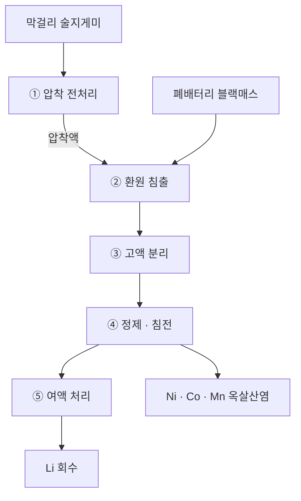
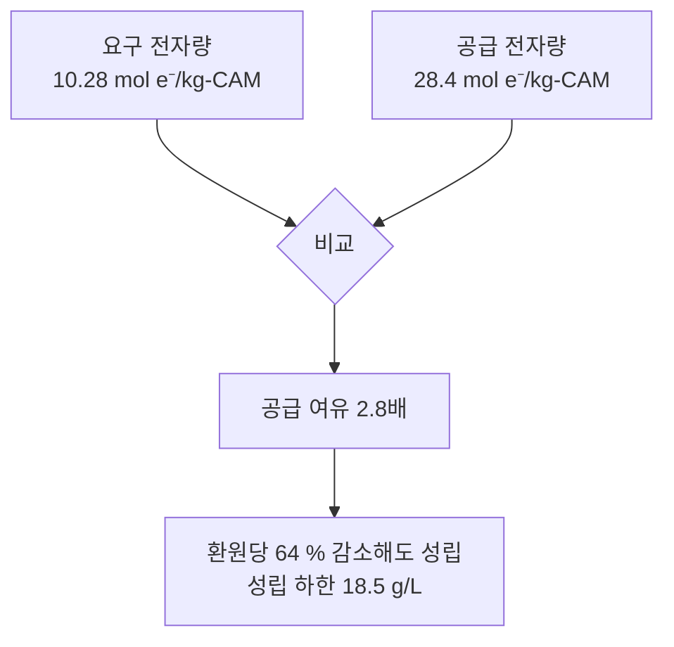

# 💡 [막걸리 술지게미를 활용한 폐배터리 환원 침출] - 포스터 부록 및 참고문헌

본 페이지는 아이디어 대회 포스터의 **섹션별 상세 근거 자료와 참고 논문**을 제공하기 위해 제작되었습니다. 
포스터의 흐름에 따라 아래의 문헌들을 참고해 주시면 감사하겠습니다

---

<br>

## 🔍 1. 필요성 및 추진목적

> **포스터 상단:** "왜 지금 이 아이디어가 필요한가?"

<br>

### 1-1. 폐배터리 발생량의 급증

전기차·ESS 보급 확대로 국내 사용후 배터리 배출량은 **2025년 8,321개에서 2030년 107,500개로 약 13배 증가**할 것으로 전망됩니다.

* **보도 자료** — [2030년 국내 폐배터리 약 10만개 이상 배출 예상, 한국경제인협회](https://web.fki.or.kr/kor/news/statement_detail.do?category=ST&bbs_id=00036369)
* **관련 기사** — [2030년 사용후배터리 10만개 급증…정부, 재사용·재활용 본격 '시동', 뉴스핌](https://www.newspim.com/news/view/20260520000434)

<br>

### 1-2. 제도적 배경 — 재활용은 이제 선택이 아닌 의무

국내에서는 **「사용후 배터리의 관리 및 산업육성에 관한 법률」이 2026년 5월 26일 공포되어 2027년 5월 27일 시행**되며, 사용후 배터리를 폐기물이 아닌 국가 전략자원으로 규율합니다.
해외에서는 **EU 배터리법이 2031년부터 신품 배터리에 재생원료 사용을 의무화**하여, EU에 진출한 국내 배터리 3사가 모두 규제 대상이 됩니다.

* **정부 보도자료** — [사용후 배터리 산업 육성을 위한 법·제도·인프라 구축방안, 관계부처 합동](https://www.newspim.com/news/view/20260520000434)
* **법률 해설** — [사용후 배터리법의 주요 내용 및 시사점, 법률신문(김·장)](https://www.lawtimes.co.kr/news/articleView.html?idxno=222505)
* **공공기관 자료** — [알기 쉬운 EU 통상 정책 시리즈 : EU 배터리 규정 Q&A, KOTRA](https://dl.kotra.or.kr/pyxis-api/2/digital-files/b2779945-a1a5-479b-a0ff-fbf585a6937f)


<br>

### 1-3. 유가금속 회수의 경제적 필요성

전 세계 폐배터리 재활용 시장은 금속 기준 **2030년 143.6만 톤(약 60조 원), 2040년 500.9만 톤(약 200조 원)** 규모로 전망됩니다.

* **시장조사기관 자료** — [전세계 폐배터리 재활용 시장 2040년 200조원 전망, SNE Research](https://www.sneresearch.com/kr/insight/release_view/75/page/0)

<br>

### 1-4. 기존 습식 제련 공정의 한계

포스터에서 지적한 **강산과 과산화수소 사용에 따른 폐수 부담과 위험성**의 근거입니다. 

**(1) 강산 침출 — 폐수 및 유해 가스**

무기산은 침출 효율이 높으나, 높은 염 부하로 인한 폐수 오염과 독성 가스 배출을 피할 수 없으며, 설비 부식과 폐액 처리의 어려움이 함께 지적됩니다.

* **Reference:** [Critical Evaluation of the Potential of Organic Acids for the Environmentally Friendly Recycling of Spent Lithium-Ion Batteries (2022)]
* **저자:** *Recycling*, 7(1), 4 — MDPI (Open Access)
* **핵심 요약:** 무기산 침출이 폐수의 높은 염 부하와 독성 가스 배출을 피할 수 없음을 지적하고, 그 대안으로 유기산 침출의 가능성을 평가한 연구입니다. 본 아이디어가 젖산 기반 유기산 침출을 채택한 배경입니다.
* 🔗 **[논문 원문 / PDF 보기](https://www.mdpi.com/2313-4321/7/1/4)**

**(2) 과산화수소 — 환원제 투입에 따른 2차 오염**

산 침출의 추출 효율을 높이기 위해 투입되는 H₂O₂는 다량 사용 시 상당한 폐수를 발생시키고 2차 오염을 유발합니다.

* **Reference:** [Recovery of critical metals from spent lithium-ion batteries by hydrogen reduction coupled with ultrasonic-water leaching (2026)]
* **저자:** *Journal of Environmental Chemical Engineering*
* **핵심 요약:** 산 침출 시 H₂O₂ 등 화학적 환원제를 다량 사용할 경우 상당한 폐수 발생과 2차 오염이 유발됨을 지적한 연구입니다. **본 아이디어가 산이 아닌 '환원제 자리'를 대체 대상으로 삼은 직접적 근거입니다.**
* 🔗 **[논문 원문 / PDF 보기](https://www.sciencedirect.com/science/article/abs/pii/S2213343726033300)**

<br>

### 1-5. 대체 원료로서의 막걸리 술지게미

**(1) 상시·대량 발생하는 국내 부산물**

수도권 양조장 조사 기준 **1일 8톤 이상**의 술지게미가 폐기되고 있으며, 양조장은 폐기물관리법·주세법에 따라 **폐기 비용을 지불하고** 처리해 왔습니다. 계절·지역에 따라 분산되는 일반 농산 부산물과 달리 주류 공장에서 상시 배출되어 수급이 안정적입니다.

* **관련 기사** — [1일 8톤 이상의 술지게미 폐기되어…, 한국농업신문](http://www.newsfarm.co.kr/news/articleView.html?idxno=61020)
* **관련 기사** — [술 빚고 남은 10 %, 어떻게 써야 할까, 농민신문](https://www.nongmin.com/article/20250630500448)

**(2) 환원 침출제로서의 조성 근거**

* **Reference:** [Production of Functional Vinegar Enriched with γ-Aminobutyric Acid through Serial Co-Fermentation of Lactic Acid and Acetic Acid Bacteria Using Rice Wine Lees (2024)]
* **저자:** Park, Y.-H.; Kwon, M.-J.; Shin, D.-M.; Lee, S.-P. — *Applied Microbiology*, 4(3), 1203–1214
* **핵심 요약:** 막걸리 주박(rice wine lees)을 원료로 기능성 식초를 제조하는 과정에서 **원물 주박의 성분을 분석한 연구**입니다.  **환원당 51.22 g/L**, **에탄올 7.26 %** 수치를 나타내며, 설계 근거 그래프의 x축 기준점이 됩니다.
* **인용 범위:** 원물 주박의 **조성값만** 인용하였습니다. 논문 내 젖산·아세트산 수치는 *Lactiplantibacillus plantarum* 등을 **인위적으로 접종한 발효 후 측정값**이므로, 본 설계의 전자 수지에는 반영하지 않았습니다.
* 🔗 **[논문 원문 / PDF 보기](https://doi.org/10.3390/applmicrobiol4030082)**

---

<br>

## ⚙️ 2. 아이디어 개념과 내용

> **포스터 중앙:** 본 팀이 제안하는 공정의 구성과 설계 근거이다.

<br>

### 2-1. 공정 구성

막걸리 술지게미 압착액을 환원제로 투입하는 습식 제련 공정이다. 두 폐기물(폐배터리 블랙매스 · 막걸리 술지게미)이 환원 침출 단계에서 합류한다.



③ 이후는 검증된 기존 습식 제련 표준 경로를 따른다. 본 아이디어의 변경 지점은 **② 환원 침출의 환원제 항목 하나**이며, 나머지 공정은 그대로 유지된다.

<br>

### 2-2. ① 압착 전처리

양조장에서 발효가 완료된 상태로 배출되므로 별도의 미생물 배양·건조·분쇄 공정이 필요하지 않다. 압착 단일 조작으로 환원당·유기산·수분을 함께 담은 압착액을 확보한다.

* **원료 조성 근거** — **1-5 참조** (환원당 51.22 g/L, 에탄올 7.26 %)

> **설계 의도** — 압착액은 그 자체가 발효 기질이므로, 잔존 미생물에 의한 환원당 소모를 막기 위해 전 구간 상온 운전 및 압착 직후 투입을 원칙으로 한다.

<br>

### 2-3. ② 환원 침출

포스터의 **젖산 1.5 M · 고액비 20 g/L · 70 °C** 조건은 아래 연구의 최적 조건을 그대로 채택한 것이다. 동일 산 · 동일 농도 · 동일 고액비에서 검증된 값이며, 본 아이디어는 이 조건에서 **환원제 자리(H₂O₂)만 술지게미 압착액으로 치환**한다.

* **Reference:** [Sustainable Recovery of Cathode Materials from Spent Lithium-Ion Batteries Using Lactic Acid Leaching System (2017)]
* **저자:** Li, L.; Fan, E.; Guan, Y.; et al. — *ACS Sustainable Chemistry & Engineering*, 5(6), 5224–5233
* **핵심 요약:** 젖산 1.5 M, 고액비 20 g/L, 70 °C, 20 min 조건에서 Li 97.7 % · Ni 98.2 % · Co 98.9 % · Mn 98.4 % 침출률 달성. 본 공정 조건의 직접 출처이며, 해당 연구의 환원제가 H₂O₂이므로 본 아이디어가 대체하려는 기준 조건에 해당
* 🔗 **[논문 원문 / PDF 보기]( )**

**환원당을 환원제로 사용한 선행 연구**

* **Reference:** [Use of Glucose as Reductant to Recover Co from Spent Lithium Ion Batteries (2017)]
* **저자:** Meng, Q.; Zhang, Y.; Dong, P. — *Waste Management*, 64, 214–218
* **핵심 요약:** 포도당을 환원제로 사용해 폐리튬이온전지에서 코발트를 회수한 연구. 당류가 무기 환원제를 대체할 수 있음을 실증
* 🔗 **[논문 원문 / PDF 보기]( )**

* **Reference:** [Acid Reducing Leaching of Cathodic Powder from Spent Lithium Ion Batteries: Glucose Oxidative Pathways and Particle Area Evolution (2014)]
* **저자:** Pagnanelli, F.; et al. — *Journal of Industrial and Engineering Chemistry*, 20(5), 3201–3207
* **핵심 요약:** 침출 과정에서 포도당의 **산화 경로**를 규명한 연구. 본 설계의 nₑ = 2 설정(알데하이드기 → 카르복실기)의 이론적 근거
* 🔗 **[논문 원문 / PDF 보기]( )**

* **Reference:** [Glucose Oxidase-Based Biocatalytic Acid-Leaching Process for Recovering Metal Values from Spent Lithium-Ion Batteries (2020)]
* **저자:** Fan, E.; et al. — *Waste Management*, 114, 166–173
* **핵심 요약:** 포도당의 산화 생성물인 **글루콘산**을 침출제로 사용해 Co · Li · Mn · Ni 95 % 이상 회수. 환원당이 산화된 이후에도 침출계에 기여함을 보인 연구
* 🔗 **[논문 원문 / PDF 보기]( )**

> **안전 설계** — 압착액에 포함된 에탄올은 조업 온도(70 °C)에서 기상부 농도가 폭발 범위에 진입할 수 있으므로, 밀폐 반응기 · 환류 냉각 · N₂ 봉입을 필수 설계 항목으로 둔다.

<br>

### 2-4. 설계 근거 — 상세 계산

포스터 그래프의 모든 수치는 아래 과정으로 산출되었다.



**(1) 요구 전자량 — 10.28 mol e⁻/kg-CAM**

NCM811 = LiNi₀.₈Co₀.₁Mn₀.₁O₂ 의 전하 중성 조건에서 출발한다.

```
LiaMbOc 에서   e⁻ = 2c − a − 2b
  a = 1                      (Li)
  b = 0.8 + 0.1 + 0.1 = 1    (Ni + Co + Mn)
  c = 2                      (O)

  e⁻ = (2 × 2) − 1 − (2 × 1) = 1 mol e⁻ / mol CAM
```

전이금속 평균 산화수가 +3이므로, 산에 용해되는 +2 상태로 만들려면 화학식 단위당 1 mol의 전자가 필요하다.

```
M(NCM811) = 97.27 g/mol
1 kg 기준  →  1000 ÷ 97.27 = 10.28 mol

요구 전자량 = 10.28 mol e⁻ / kg-CAM
```

**(2) 공급 전자량 — 28.4 mol e⁻/kg-CAM**

```
환원당 51.22 g/L ÷ 180.16 g/mol = 0.2843 mol/L

nₑ = 2  (알데하이드기 → 카르복실기 산화)
  R–CHO + H₂O  →  R–COOH + 2H⁺ + 2e⁻

  0.2843 × 2 = 0.5686 mol e⁻ / L

고액비 20 g/L  →  침출 액상 50 L / kg-CAM
공급 전자량 = 0.5686 × 50 = 28.43 mol e⁻ / kg-CAM
```

**(3) 공급 여유 — 2.8배**

```
28.43 ÷ 10.28 = 2.77  ≈  2.8 배
```

**(4) 성립 하한 — 환원당 18.5 g/L**

요구량을 정확히 충족하는 최소 환원당 농도를 역산한다.

```
필요 농도 = 10.28 ÷ (2 × 50 ÷ 180.16) = 18.52 g/L

감소 허용폭 = (51.22 − 18.52) ÷ 51.22 = 63.8 %  ≈  64 %
```

폐기물 원료의 조성이 배치마다 변동하더라도, 환원당이 64 % 감소할 때까지 공정이 성립한다. 이것이 포스터 그래프의 **안전 운전 영역**이다.

**(5) 보수적 설계 — 에탄올 제외**

에탄올(7.26 %)은 nₑ = 4로 환원당보다 전자 공여력이 크다. 그러나 끓는점이 78 °C로 조업 온도에 근접해 기화에 따른 반응 불확실성이 크므로, 전자 수지에서 **0으로 완전 배제**하였다. 위 2.8배는 에탄올을 전혀 계상하지 않은 값이며, 실제 가용 전자는 이보다 크다.

<br>

### 2-5. 후처리 경로

환원 침출 이후는 검증된 기존 습식 제련 표준 경로를 따르며, 산도를 단계적으로 상향한다.

| 단계 | 조작 | 비고 |
|---|---|---|
| ③ 고액 분리 | 필터 프레스 | 흑연 · 분리막 잔사 제거 |
| ④-1 알루미늄 제거 | pH 4.5 ~ 5.0 | 집전체 유래 Al 선택 침전 |
| ④-2 옥살산 침전 | 옥살산 투입 | Ni · Co · Mn 혼합 옥살산염 회수 |
| ⑤ 여액 처리 | 탄산화 | Li 회수 |

> **중화제 선택** — ④-1의 pH 조절에는 NaOH를 사용한다. Ca 계열 중화제는 잔류 Ca²⁺가 후단 옥살산 침전에서 CaC₂O₄로 공침하여 산물을 오염시키므로 배제한다.

---

<br>

## 📈 3. 활용방안 및 기대효과

> **포스터 하단:** 아이디어 적용 시 예상되는 효과와 그 타당성 근거이다.

<br>

### 3-1. 안정성 향상 — 과산화수소 대체

기존 습식 제련의 환원제인 과산화수소(H₂O₂)는 농도 36 % 이상일 때 「위험물안전관리법」상 **제6류 산화성 액체**로 분류되며, 저장·운반·취급 전 과정에서 별도의 안전관리가 요구된다. 반면 막걸리 술지게미는 위험물 분류에 해당하지 않는 식품 부산물로 상온 취급이 가능하다.

| 항목 | 기존 — 과산화수소 | 제안 — 술지게미 압착액 |
|---|---|---|
| 법적 분류 | 위험물 제6류 산화성 액체 | 해당 없음 (식품 부산물) |
| 주요 위험성 | 산화성 · 부식성 · 분해 시 산소 발생 | 해당 없음 |
| 저장 · 취급 | 분해 및 발열 관리 필요 | 상온 취급 |
| 조달 경로 | 시약 구매 | 폐기 비용 지불 중인 부산물 |

* **법령** — [위험물안전관리법 시행령 별표 1 (위험물 및 지정수량), 국가법령정보센터]( )
* **공식 자료** — [과산화수소 물질안전보건자료(MSDS), 안전보건공단]( )

<br>

### 3-2. 고가 시약 대체 및 폐기물 통합 처리

본 공정은 상용 환원제를 **처리 비용이 발생하던 부산물**로 대체한다. 양조장은 폐기물관리법·주세법에 따라 술지게미 폐기 비용을 지불해 왔으므로, 배터리 재활용 업체의 시약비와 양조장의 폐기물 처리비가 동시에 절감된다.

또한 계절·지역에 따라 발생이 분산되는 일반 농산 부산물과 달리 주류 공장에서 상시·집중 배출되어 원료 수급과 물류가 안정적이다.

* **발생량 및 폐기 비용 구조** — **1-5 참조**
* **정책 근거** — [주박은 음료 목적이 아닌 경우 주세법상 주류에 해당하지 않음 (식품의약품안전처, 2020), 농민신문]( )

> 식약처 유권해석에 따라 주박의 산업적 활용 범위가 확대되어, 식품 외 용도로의 전환에 법적 제약이 없다.

<br>

### 3-3. 습식 제련 공정의 시약 부담 저감

기존 습식 제련은 강산 침출에 따른 폐수·유해 가스 부담과, 환원제 다량 투입에 따른 2차 오염 문제가 함께 지적되어 왔다. 본 공정은 이 중 **환원제 투입 항목**을 폐기물 유래 물질로 대체하여 외부 시약 소요를 줄이고, 두 폐기물을 단일 공정에서 처리한다.

* **기존 공정의 폐수 및 시약 부담** — **1-4 참조**
* **재생원료 활용 정책 배경** — **1-2 참조**

> **주장의 범위** — 본 아이디어는 침출제(산) 자체를 대체하는 것이 아니라 **환원제 자리를 대체**하는 것을 목표로 한다. 유기산 침출 전반의 환경 우위는 전과정평가(LCA) 연구에서 논쟁이 있으므로, 본 페이지에서는 시약 투입 감소와 폐기물 통합 처리에 한정하여 기대효과를 제시한다.

* **Reference:** [Environmental Impact Assessment of LiNi₁ᐟ₃Mn₁ᐟ₃Co₁ᐟ₃O₂ Hydrometallurgical Cathode Recycling from Spent Lithium-Ion Batteries]
* **저자:** *ACS Sustainable Chemistry & Engineering*
* **핵심 요약:** NCM 양극재 재활용 9개 경로를 전과정평가로 비교한 연구. 유기산 경로가 무기산 경로 대비 반드시 우월하지는 않음을 제시하여, 본 아이디어의 주장 범위를 한정하는 근거로 인용
* 🔗 **[논문 원문 / PDF 보기]( )**

---
